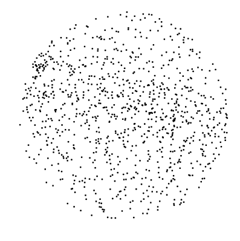
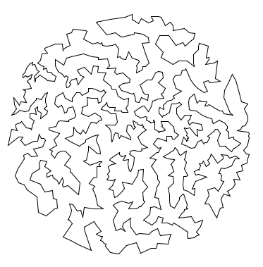
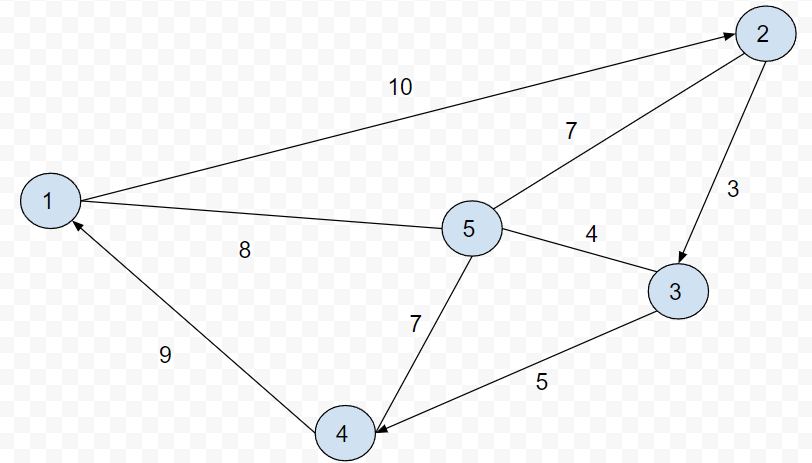
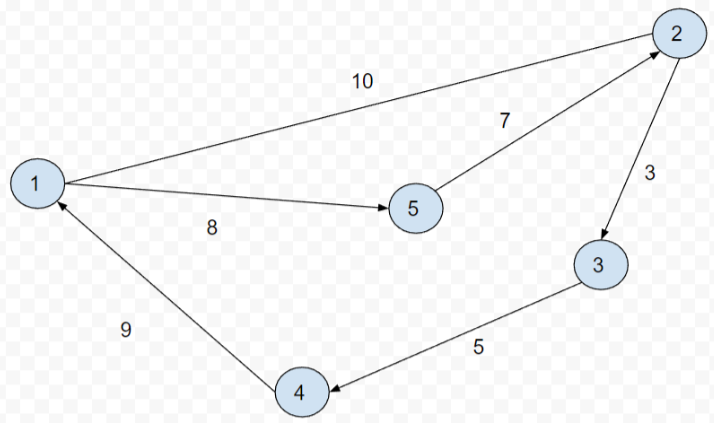
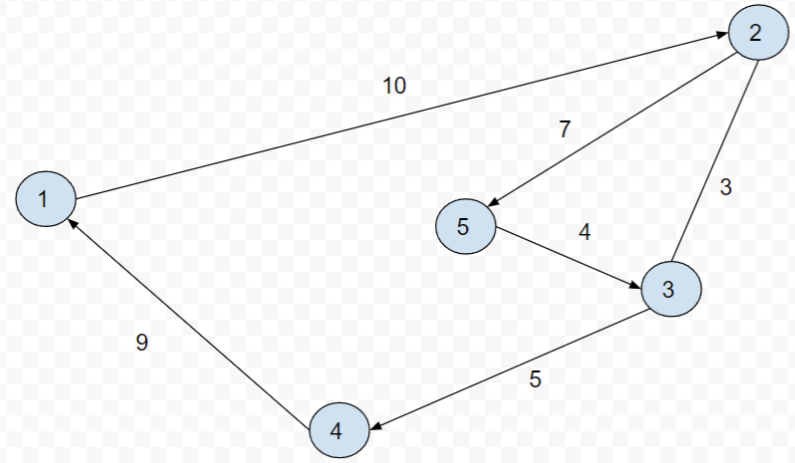
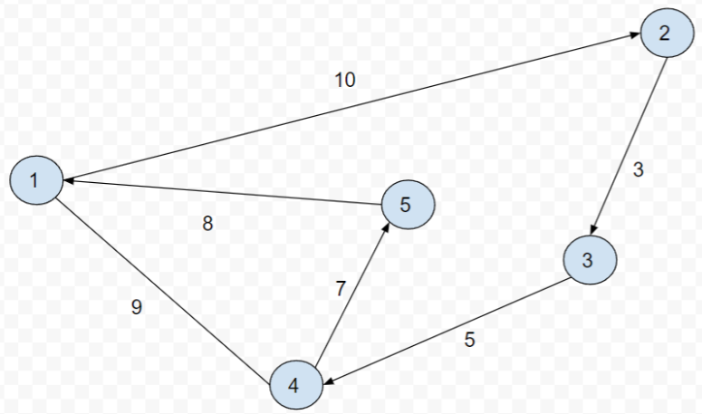
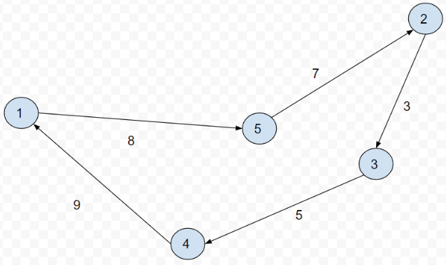

# Traveling Salesman Problem
***Problem Statement.*** Given N points in the plane, the goal of a traveling salesperson is to visit all of them (and arrive back home) while keeping the total distance traveled as short as possible. Implement two greedy heuristics to find good (but not optimal) solutions to the traveling salesperson problem (TSP).

More information can be found [here](https://en.wikipedia.org/wiki/Travelling_salesman_problem)

***Perspective.*** The importance of the TSP does not arise from an overwhelming demand of salespeople to minimize their travel distance, but rather from a wealth of other applications such as vehicle routing, circuit board drilling, VLSI design, robot control, X-ray crystallography, machine scheduling, and computational biology.

***Greedy heuristics.*** The traveling salesperson problem is a notoriously difficult combinatorial optimization problem, In principle, one can enumerate all possible tours and pick the shortest one; in practice, the number of tours is so staggeringly large (roughly N factorial) that this approach is useless. For large N, no one knows an efficient method that can find the shortest possible tour for any given set of points. However, many methods have been studied that seem to work well in practice, even though they are not guaranteed to produce the best possible tour. Such methods are called heuristics. ***Your main task is to implement the nearest neighbor and smallest increase insertion heuristics for building a tour incrementally.*** Start with a one-point tour (from the first point back to itself), and iterate the following process until there are no points left.

- ***Nearest neighbor heuristic***: Read in the next point (p) and find the point already in the Tour that is closest to the p. Then add p to the current tour after the point to which it is closest. (If there is more than one point to which it is closest, insert it after the first such point you discover.)
- ***Smallest increase heuristic***: Read in the next point (p). Iterate through the tour to find the point where adding p would result in the least possible increase in the tour length. (If there is more than one point, insert it after the first such point you discover.) See the section later on a walk through of how the smallest increase heuristic works on a specific example.

## Smallest Increase Heuristic Explained

We'll walk through a quick example of smallest increase heuristic and how it inserts points into an existing Tour.

Note: Arrows indicate the order of the current Tour. It is 1->2->3->4.

Now we are adding 5 to the tour. We have the option to add it after each point. So we can create the following tours when inserting 5. We'll choose the best one based on the smallest increase heuristic.

1->5->2->3->4

1->2->5->3->4

1->2->3->5->4

1->2->3->4->5

Let’s add (5) after (1) creating the Tour of 1->5->2->3->4->1. This gives us a total tour of 8+7+3+5 + 9 = 32. An increase in 5 from our original distance of 27.

We actually can determine how much we would increase the tour distance without looking at the entire tour. This is because when we consider adding 5 to the tour, we can look at the original distance between 1 and 2 which is 10, then look at the distance it takes to go from 1->5->2 which is 15. Because the rest of the Tour is unchanged, we know that the overall increase to the tour distance will be 15 - 10 = 5. 

We want to insert the next point into the tour where it will have the smallest increase in distance. Let’s continue a few more iterations where we check the increased distance of adding Point 5 in between other Points.

Let’s try adding 5 between 2 and 3. Notice the increased distance of the tour is (7+4)-3 = 8. 

Since this 8 is more than 5, we do not want to insert 5 in between 2 and 3.

Now we insert 5 between 3 and 4. Notice the increased distance is 7+4-5 = 6. This is more than 5 so we would choose not want to insert 5 between 3 and 4. Right now inserting between 1 and 2 is still the best choice.

Lastly, we have the option to insert 5 after 4 so between 4 and 1. However once again we notice by inserting 5 here, we would increase the tour size by 7+8-9 = 6. Therefore we would still prefer to insert between 1 and 2.

In conclusion, since inserting between 1 and 2 gives us the smallest increase in distance (which is 5).

Therefore our tour would look like this after inserting (5) with a total distance of 8+7+3+5+9 = 32

## Additional Context for TSP

If may help to watch the first 15 minutes of [this video](https://www.youtube.com/watch?v=GiDsjIBOVoA) to get some more context on the TSP problem. The latter 15 minutes dive deeper on some more complex heuristics that are not needed for this assignment, but we encourage you to watch if you are interested.

## Deliverables

Your task is to populate the point.py file and the tour.py file per the test specifications in main_test.py.